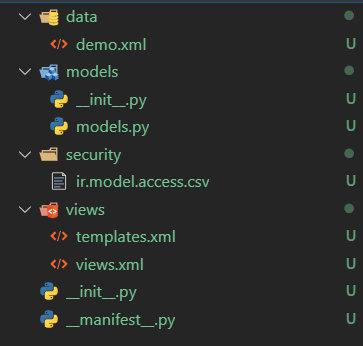

# Odoo新建模块

## 利用odoo-bin命令新建模块

>在docker中利用odoo-bin命令新建模块

```bash
# 启动docker中的容器
docker start <CONTAINER ID>

# 进入容器终端(windows cmd 需要在前面加winpty)
docker exec -it <CONTAINER ID> /bin/bash

# 进入容器后终端执行
pyhton3 odoo/odoo-bin scaffold <module name> <where to put it>
```
> 生成的模块如图所示



> `__manifest__.py` Odoo模块声明文件  
> `__init__.py`     python模块声明导入  
> `models/*.py`     模型定义文件  
> `views/*.xml`     视图定义文件  
> `data/*.xml`      预置数据文件